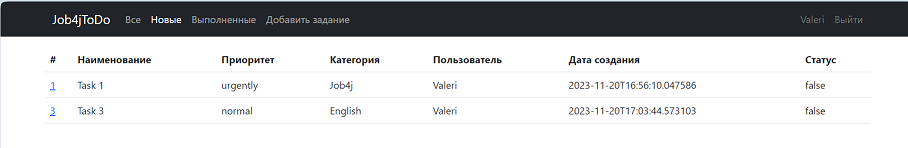
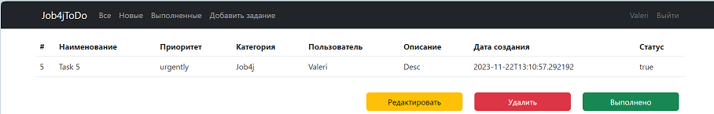
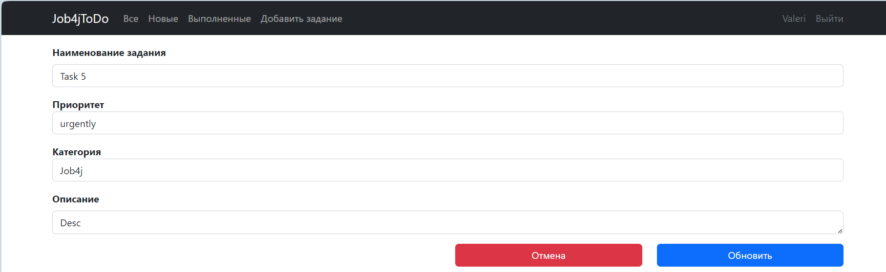

# job4j_todo

## О проекте

Проект представляет собой список заданий и позволяет контролировать их выполнение.

В шапке главной страницы кнопки "Все", "Новые", "Выполненные" и "Добавить задание" при нажатии на которые можно,
соответственно, перейти на страницы со списком всех заданий, новых, выполненных и добавления нового задания:

 

При переходе по ссылке на конкретное задание, вы попадаете на страницу,
где можно редактировать, удалить или выполнить задание с помощью соответствующих кнопок:

 

Нажав кнопку "Редактировать", вы переходите на страницу редактирования задания и можете изменить его наименование и 
описание:

## Стек технологий

Java 17, Hibernate 5, Maven 3.8, Spring 2.7 (в частности Spring MVC и Spring Boot),
Thymeleaf, Bootstrap, Liquibase 4.15, PostgreSQL 15.

## Требования к окружению

Java 17, Maven 3.8, PostgreSQL 15.

## Запуск проекта

**Создать БД командой create database todo;**
**Запустить проект командой mvn spring-boot:run**

## Контакты

aquastar.minsk@gmail.com